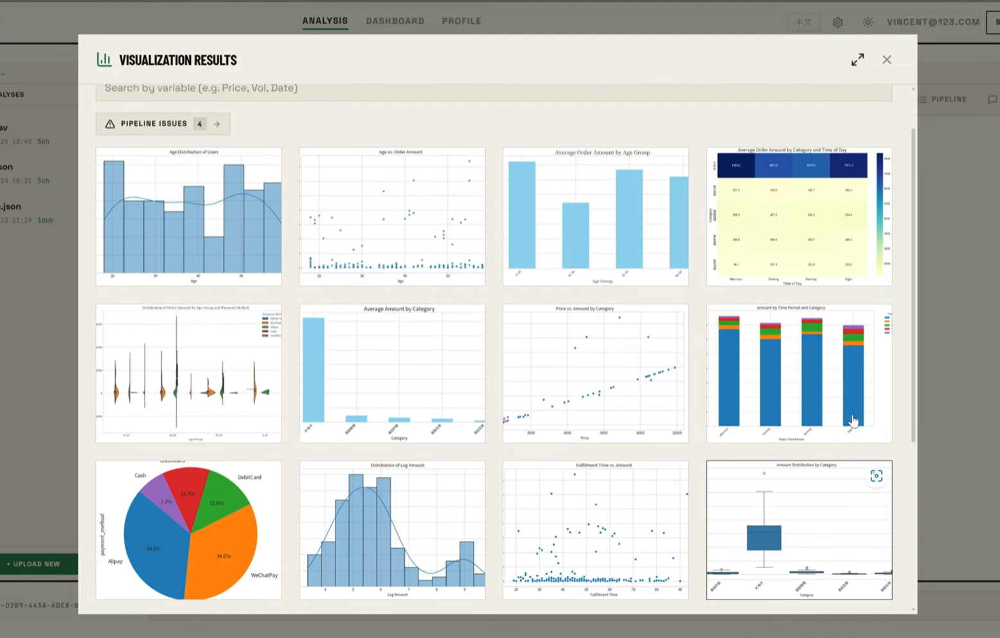
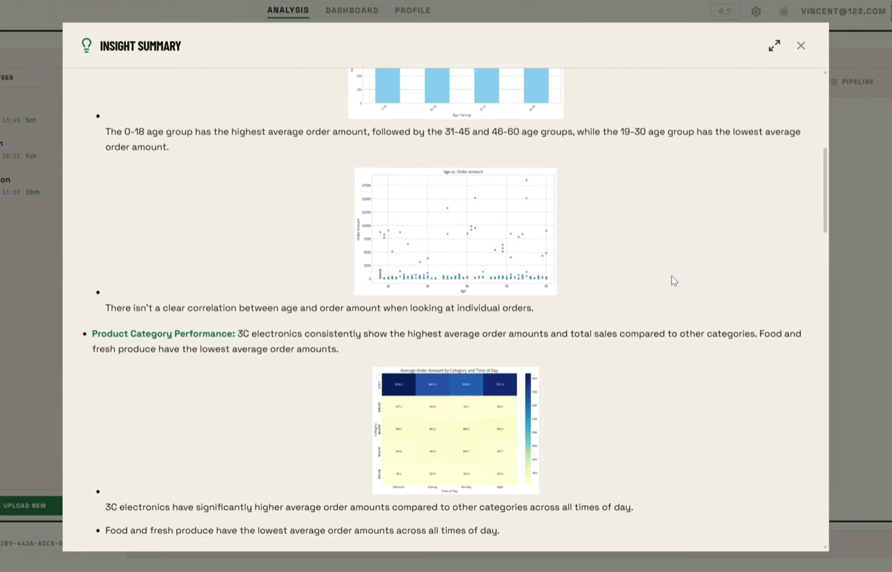
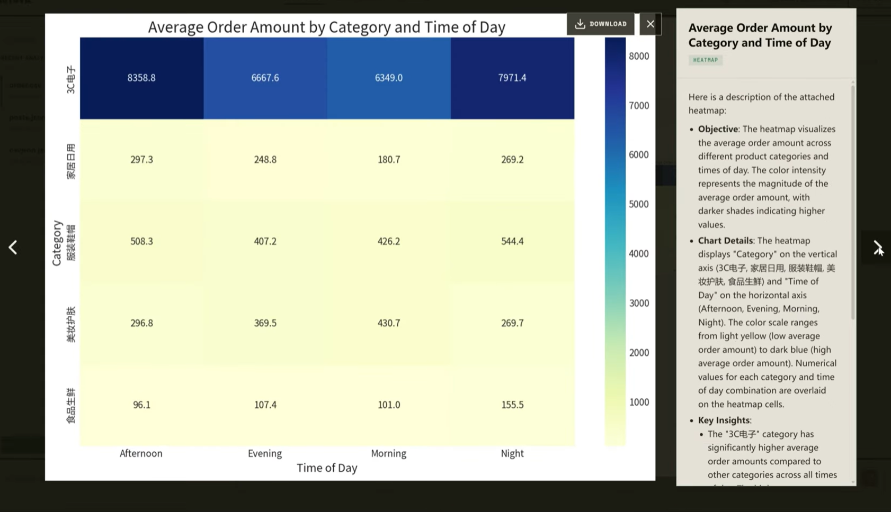
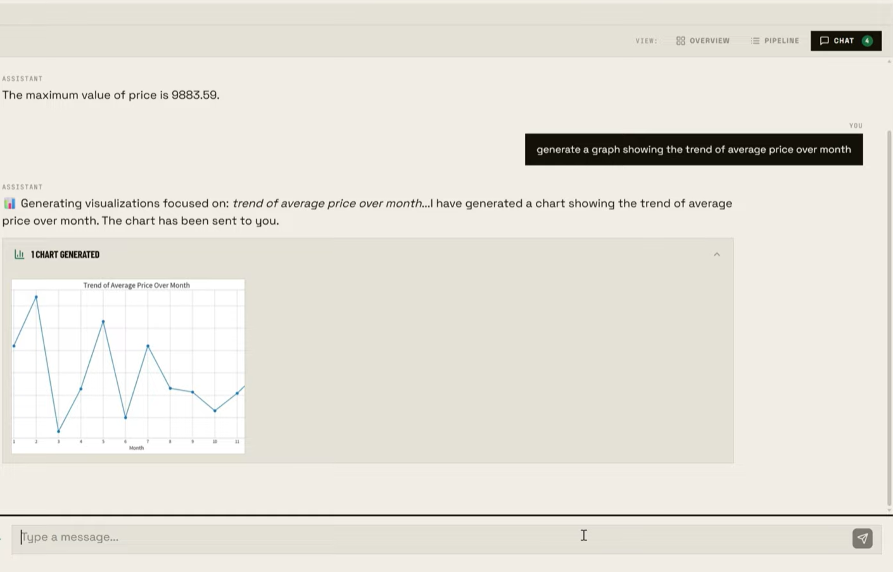

# Autoviz

**AI-powered, multi-agent data visualization and insight platform**

Autoviz is a multi-agent data intelligence platform built for non-technical users.
It turns CSV, JSON, or URL-hosted tabular data into automated visualizations, structured
reports, and a natural-language analytics experience. The system combines hierarchical
agent orchestration, sandboxed Python execution, context engineering, and persistent
full-stack workflows in a production deployment serving more than 100 users.

## Demo

[](https://youtu.be/qeitwrWg6WQ)

## Product Experience

<table>
  <tr>
    <td width="50%">
      
      <br />
      <sub><strong>Visualization gallery.</strong> Review generated charts together, search results, and surface pipeline issues.</sub>
    </td>
    <td width="50%">
      
      <br />
      <sub><strong>Structured report.</strong> Consolidate generated visualizations and AI-written findings into a reviewable insight summary.</sub>
    </td>
  </tr>
  <tr>
    <td width="50%">
      
      <br />
      <sub><strong>Chart-level insight.</strong> Open a generated visualization beside its AI-written interpretation and download controls.</sub>
    </td>
    <td width="50%">
      
      <br />
      <sub><strong>Conversational analysis.</strong> Request a chart in natural language and receive the generated result in the same analysis thread.</sub>
    </td>
  </tr>
</table>

## Features

- **Hierarchical multi-agent reasoning** — a PydanticAI Planner/Worker/Critic workflow
  combines parallel task execution with dynamic replanning for visualization generation
  and review
- **End-to-end data workflows** — multi-step orchestration covers data transformation,
  LLM-driven feature engineering, visualization, and structured reporting for datasets
  averaging more than 100K rows
- **Conversational analytics** — intent routing, tool calling, context engineering, and
  model routing support natural-language analysis while reducing token usage by 29%
- **Sandboxed execution** — generated feature-engineering and chart code runs in Modal
  Sandboxes built from a cached data-science image with CJK font support
- **Iterative quality control** — bounded code retries and semantic replanning contribute
  to a 98%+ task success rate with 72-second P99 latency
- **Streaming full-stack product** — FastAPI HTTP/WebSocket endpoints feed a Next.js
  analysis and chat interface backed by async PostgreSQL persistence
- **Production workflows** — JWT/OAuth authentication, guest mode, English/Chinese UI,
  user-supplied OpenRouter keys, quizzes, PDF/DOCX export, and analytics instrumentation

## Tech Stack

| Layer          | Technology                                                   |
| -------------- | ------------------------------------------------------------ |
| Backend        | FastAPI, Python 3.12+, PydanticAI, async SQLAlchemy/SQLModel |
| Frontend       | Next.js 15, React 19, TypeScript, Tailwind CSS v4            |
| AI             | OpenRouter-backed language models                            |
| Code execution | Modal Sandboxes                                              |
| Data           | PostgreSQL, Pandas, Matplotlib, Seaborn                      |
| Auth           | JWT in HTTP-only cookies, OAuth                              |
| Hosting        | Google Cloud Run backend, Firebase Hosting frontend          |

## Architecture

```text
Browser (Next.js 15)
  ├─ HTTP API proxy ───────────────┐
  └─ direct WebSocket stream ──────┤
                                   ▼
                            FastAPI routes
                              ├─ Services ── Repositories ── PostgreSQL
                              └─ Agent orchestration (PydanticAI)
                                   ├─ OpenRouter language models
                                   └─ Modal Sandboxes
                                        ├─ feature engineering code
                                        └─ visualization code → PNG
```

FastAPI owns request validation, authentication, and streaming lifecycle concerns.
Services coordinate domain behavior, repositories isolate persistence, and the agent
pipeline delegates generated code to Modal rather than executing it on the API host.

## Visualization Pipeline

```text
tabular input
  → normalize and summarize
  → generate feature-engineering code → Modal → enhanced CSV
  → Planner creates chart tasks
  → selector checks feasibility and information gain (when enabled)
  → Workers execute tasks concurrently
       → generate Python → Modal renders PNG → Critic reviews output
       → code failure: retry with feedback
       → semantic rejection: dynamically plan a replacement task
       → accepted chart: generate annotation and persist result
  → synthesize accepted results into a structured report
```

Configurable retry and semantic-replan limits bound the workflow while allowing
recoverable execution errors and unsuitable chart choices to be corrected.

## Getting Started

### Prerequisites

- [Python 3.12+](https://www.python.org/) and [uv](https://docs.astral.sh/uv/)
- [Node.js 18+](https://nodejs.org/) and [Bun](https://bun.sh/)
- PostgreSQL 16, locally or through Docker
- Modal credentials, plus either a project OpenRouter key or a key supplied in the UI

### 1. Clone and configure

```bash
git clone https://github.com/SwordSong-Legacy/Autoviz.git
cd Autoviz
cp .env.example .env
```

Replace every marked value in `.env`. In particular, generate a unique `SECRET_KEY` of
at least 32 characters and add `MODAL_TOKEN_ID` and `MODAL_TOKEN_SECRET`. A project-level
OpenRouter key is optional when users provide their own key in the UI.

### 2. Start PostgreSQL and the backend

```bash
make docker-db
cd backend
uv sync
uv run autoviz db upgrade
uv run autoviz server run --reload
```

- Backend: http://localhost:8000
- API documentation: http://localhost:8000/docs

### 3. Start the frontend

```bash
cd frontend
bun install
bun dev
```

The frontend runs at http://localhost:3000. Its checked-in development configuration
targets the local backend; deployment URLs can be overridden with
`NEXT_PUBLIC_BACKEND_URL`, `NEXT_PUBLIC_WS_URL`, and `BACKEND_URL`.

### Docker alternative

After creating `.env`, start the backend and PostgreSQL with:

```bash
make docker-up
make db-init
```

Then run the frontend locally as shown above, or use `docker-compose.frontend.yml`.

## Project Structure

```text
Autoviz/
├── backend/
│   ├── app/api/routes/v1/  # HTTP and WebSocket endpoints
│   ├── app/agents/         # PydanticAI agents
│   ├── app/pipelines/      # Ingestion, feature engineering, visualization
│   ├── app/services/       # Business logic, Modal execution, analytics
│   ├── app/repositories/   # Database access
│   ├── app/db/models/      # SQLModel models
│   └── tests/
├── frontend/               # Next.js application, auth, chat, analysis, i18n
├── docker-compose.yml
└── Makefile
```

## Quality Checks

```bash
# Backend
cd backend
uv run ruff check app tests cli
uv run ruff format --check app tests cli
uv run mypy app
uv run pytest tests -v

# Frontend
cd frontend
bun run format:check
bun run type-check
bun run test:run
```

## Deployment

The Dockerized application is deployed on GCP and serves more than 100 users. The
existing hosted build is available at the
[Autoviz live application](https://autoviz-fyp4502.web.app/), backed by the configured
[Cloud Run service](https://fyp4502-backend-137393663085.asia-east1.run.app). These URLs
retain legacy external resource identifiers so the live application continues to work.

The repository includes helpers for the currently configured Google Cloud and Firebase
projects:

```bash
make docker-gcr
make deploy-frontend
```

`make docker-gcr` builds and pushes the backend image to the configured Artifact Registry;
it does not run the Cloud Run release step. `make deploy-frontend` builds the static
Next.js export and deploys it with the root Firebase configuration. Review the Makefile,
Firebase project mapping, and environment-specific URLs before targeting new resources.
